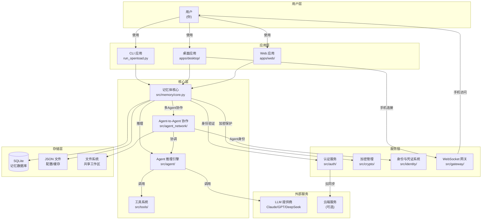

# OpenToad 🐸

<p align="center">
  <strong>你的 AI 记忆分身</strong><br />
  独立执行 · 长期记忆 · 多 Agent 协作 · 自我进化
</p>

<p align="center">
  <a href="http://opentoad.cn" target="_blank">
    
  </a>
</p>

<p align="center">
  <a href="https://github.com/lindechang/openToad">
    
  </a>
  <a href="https://github.com/lindechang/openToad">
    
  </a>
  <a href="https://github.com/lindechang/openToad/blob/main/LICENSE">
    
  </a>
  <a href="https://github.com/lindechang/openToad/releases">
    
  </a>
</p>

***

## ⭐ 简介

**OpenToad – 你的 AI 记忆分身**

它不是传统意义上的 AI 助手——不是等你发号施令的聊天机器人，也不是一次性的任务执行器。OpenToad 被设计为**能够独立行动的智能体**：它拥有长期记忆，能记住你的目标、习惯与上下文；它具备多智能体协作能力，能将复杂任务自动拆解、分派、汇总；它在你的授权下主动推进任务，并在长期陪伴中与你协同进化。

### 核心理念

> **最真实的人格 = 常年累月积累的记忆体**

每一次对话、每一个决策、每一段上下文，都会被吸收进它的记忆体系，让它越来越懂你，越来越像"另一个你"。

它既是一个**能记住你的智能体**，也是一个**能替你行动的智能体**。

## 🔍 背景

### 现有 AI 助手的三个局限

当前主流 AI 产品（ChatGPT、Claude、DeepSeek 等）虽然能力强大，但在**个人化陪伴与持续执行**方面存在三个结构性问题：

1. **无状态对话**：每次对话都是一次"重启"，AI 记不住你昨天说过什么、上周定过什么目标，更无法形成长期、连贯的协作关系。
2. **被动响应**：AI 只在收到指令时工作，无法主动推进任务、提醒关键节点或在适当时机提出建议。
3. **单体架构**：一个 AI 模型试图解决所有问题，复杂任务（如"策划一次旅行 + 预订机票 + 整理预算"）缺乏内部的分工协作机制。

### OpenToad 的出发点

OpenToad 从设计之初就试图回答三个问题：

- **如果 AI 能记住你呢？** —— 于是有了**长期记忆中枢**
- **如果 AI 能主动行动呢？** —— 于是有了**独立执行引擎**
- **如果多个 AI 能协同工作呢？** —— 于是有了**Agent-to-Agent（A2A）协作系统**

### 技术定位

OpenToad 不试图替代现有 LLM 的能力，而是在它们之上构建一个**个人化的智能体操作系统**：

- **记忆体** 作为长期状态载体
- **多智能体架构** 作为任务执行的协作范式
- **Gateway + A2A 协议** 作为开放互联的基础设施
- **身份与凭证系统** 作为信任与安全边界

最终目标是让每个人都能拥有一个**属于自己的、可成长的、能行动的 AI 分身**。

### 主要功能

| 功能 | 说明 |
| --- | --- |
| **智能记忆系统** | 记住你的身份、偏好、目标和习惯，每次对话自动加载相关记忆 |
| **多模型 Agent** | ReAct 推理循环，10+ LLM 提供商支持，动态工具选择 |
| **Agent Network 协作** | 多 Agent 协同工作，任务自动分配与汇总 |
| **独立执行任务** | 无需你持续干预，OpenToad 可按计划完成多步操作 |
| **主动式智能体** | 在合适的时间主动提出建议、执行动作或提醒 |
| **与你协同进化** | 使用越久，越懂你的节奏与优先级 |

### 隐私优先

你的记忆与任务数据仅属于你。OpenToad 在设计上遵循**本地优先**与**可控授权**原则。

### 适合谁？

- 你希望有一个"能做事"的 AI，而不只是回答问题
- 你需要一个长期陪伴、记住上下文的智能伙伴
- 你希望有多个 AI Agent 协同工作，分工合作
- 你熟悉 AI 智能体，但希望它更像"另一个你"

## 🏗️ 系统架构



### 核心模块说明

| 模块 | 职责 | 文件位置 |
|------|------|---------|
| **记忆体系统** | 长期记忆存储、身份管理、遗忘机制 | [src/memory/](file:///Users/lindechang/Desktop/BOOK/workSpace/aiPrj/OpenToad/src/memory) |
| **Agent 推理引擎** | ReAct 循环、Tool 调用、任务执行 | [src/agent/](file:///Users/lindechang/Desktop/BOOK/workSpace/aiPrj/OpenToad/src/agent) |
| **A2A 协作系统** | 多 Agent 协调、任务分配、共享工作区 | [src/agent_network/](file:///Users/lindechang/Desktop/BOOK/workSpace/aiPrj/OpenToad/src/agent_network) |
| **认证服务** | 用户登录、加密密钥管理、会话控制 | [src/auth/](file:///Users/lindechang/Desktop/BOOK/workSpace/aiPrj/OpenToad/src/auth) |
| **加密管理** | AES-256 加密、记忆体保护 | [src/crypto/](file:///Users/lindechang/Desktop/BOOK/workSpace/aiPrj/OpenToad/src/crypto) |
| **身份与凭证** | Agent 信誉评分、证书系统 | [src/identity/](file:///Users/lindechang/Desktop/BOOK/workSpace/aiPrj/OpenToad/src/identity) |

## ✨ 核心功能

### 🎯 智能记忆系统

- **长期记忆**：记住你的身份、偏好、目标和习惯
- **自动分类**：智能将记忆分类（身份/偏好/知识/项目）
- **上下文注入**：每次对话自动加载相关记忆
- **加密保护**：敏感信息 AES-256-GCM 加密存储
- **多用户隔离**：支持独立的记忆空间

### 🤖 多模型 Agent

- **ReAct 推理**：思考 → 行动 → 观察的循环
- **10+ LLM 支持**：Claude / GPT-4 / DeepSeek / Qwen 等
- **动态工具选择**：根据任务自动选择最合适的工具
- **流式输出**：实时显示思考过程

### 🌐 Agent Network 协作

- **多 Agent 角色**：Coordinator / Worker / Researcher / Writer / Reviewer
- **智能任务分配**：自动拆分复杂任务并分配给合适的 Agent
- **共享工作区**：多 Agent 协作的笔记、文件、追踪
- **自我进化**：性能监控、自动优化、持续学习
- **身份凭证系统**：Agent 身份验证与信誉评分

### 🔐 安全与身份

- **身份凭证系统**：Agent 身份验证与信誉评分
- **Gateway 连接**：手机与电脑的安全连接
- **加密存储**：本地加密保护用户数据
- **多用户隔离**：独立记忆空间

## 🛠️ 技术栈

- **语言**: Python 3.10+
- **核心框架**: Typer + Rich (CLI)
- **Web 框架**: FastAPI + Uvicorn
- **存储**: SQLite + JSON
- **加密**: AES-256-GCM
- **LLM 支持**: Claude, GPT-4, DeepSeek, Qwen 等 10+ 提供商

## 🎨 多端支持

### CLI 应用 (`run_opentoad.py`)

- 完整的 ReAct Agent
- 记忆系统集成
- 10+ LLM 提供商支持
- Rich UI 美化界面
- Web 模式支持

### 桌面应用 (`apps/desktop/`)

- PyQt5 跨平台界面
- Agent Network 可视化面板
- Gateway 手机连接功能
- 多会话管理
- 记忆系统管理

### Web 应用 (`apps/web/`)

- FastAPI 后端
- WebSocket 实时通讯
- Agent Network 界面
- RESTful API 接口

## 🚀 快速开始

### 环境要求

- Python 3.10+ (已完全兼容)
- pip 20.0+

### 安装

```bash
# 克隆仓库
git clone https://github.com/lindechang/openToad.git
cd openToad

# 安装核心依赖
pip install -e .

# 安装桌面应用依赖
pip install -e apps/desktop

# 安装 Web 应用依赖
pip install -r apps/web/backend/requirements.txt
```

### 配置

```bash
# 复制环境配置
cp .env.example .env

# 编辑配置文件
# PROVIDER=anthropic
# API_KEY=your-key-here
# MODEL=claude-3-5-sonnet-20241022
```

### 运行

#### macOS / Linux

```bash
# 方式 1: 使用启动脚本（推荐，完整功能）
./opentoad.sh

# 方式 2: 直接运行完整功能 CLI
python3 run_opentoad.py

# 方式 3: 启动 Web 模式
python3 run_opentoad.py --web --port 8000
# 然后访问 http://localhost:8000

# 方式 4: 启动桌面应用
python3 apps/desktop/src/main.py
```

#### Windows

```batch
# 方式 1: 使用启动脚本（推荐，完整功能）
opentoad.bat

# 方式 2: 直接运行完整功能 CLI
python run_opentoad.py

# 方式 3: 启动 Web 模式
python run_opentoad.py --web --port 8000
# 然后访问 http://localhost:8000

# 方式 4: 启动桌面应用
python apps/desktop/src/main.py
```

### CLI 交互命令

OpenToad 提供了丰富的交互命令：

- `/help` - 显示帮助信息
- `/identity` - 查看 AI 身份信息
- `/memories` - 查看记忆列表
- `/remember [内容]` - 手动添加重要记忆
- `/config` - 查看或修改配置
- `/clear` - 清空当前对话历史

## 📖 文档

### 官方资源

- **官网**: [http://opentoad.cn/](http://opentoad.cn/)
- **GitHub**: [https://github.com/lindechang/openToad](https://github.com/lindechang/openToad)
- **开发概述**: [docs/OPENTOAD_DEVELOPMENT_OVERVIEW.md](file:///Users/lindechang/Desktop/BOOK/workSpace/aiPrj/OpenToad/docs/OPENTOAD_DEVELOPMENT_OVERVIEW.md)

### 用户指南

- **CLI 使用指南**: [docs/user-guide/cli.md](file:///Users/lindechang/Desktop/BOOK/workSpace/aiPrj/OpenToad/docs/user-guide/cli.md)
- **Web 使用指南**: [docs/user-guide/web.md](file:///Users/lindechang/Desktop/BOOK/workSpace/aiPrj/OpenToad/docs/user-guide/web.md)
- **桌面使用指南**: [docs/user-guide/desktop.md](file:///Users/lindechang/Desktop/BOOK/workSpace/aiPrj/OpenToad/docs/user-guide/desktop.md)

### 设计文档

- **记忆体系统设计**: [docs/plans/2026-03-20-memory-system-design.md](file:///Users/lindechang/Desktop/BOOK/workSpace/aiPrj/OpenToad/docs/plans/2026-03-20-memory-system-design.md)
- **记忆体系统实现**: [docs/plans/2026-03-20-memory-system-implementation.md](file:///Users/lindechang/Desktop/BOOK/workSpace/aiPrj/OpenToad/docs/plans/2026-03-20-memory-system-implementation.md)
- **Agent-to-Agent 协作系统设计**: [docs/plans/2026-05-01-agent-to-agent-design.md](file:///Users/lindechang/Desktop/BOOK/workSpace/aiPrj/OpenToad/docs/plans/2026-05-01-agent-to-agent-design.md)
- **Agent-to-Agent 实现计划**: [docs/plans/2026-05-01-agent-to-agent-implementation.md](file:///Users/lindechang/Desktop/BOOK/workSpace/aiPrj/OpenToad/docs/plans/2026-05-01-agent-to-agent-implementation.md)

### 其他

- **功能清单**: [docs/OpenToad项目功能清单.md](file:///Users/lindechang/Desktop/BOOK/workSpace/aiPrj/OpenToad/docs/OpenToad项目功能清单.md)

## 🏗️ 项目结构

```
opentoad/
├── src/                # 核心代码
│   ├── agent/         # Agent 推理核心 (ReAct 循环)
│   ├── agent_network/ # Agent-to-Agent 协作系统 ⭐⭐
│   │   ├── role.py       # 角色与能力系统
│   │   ├── task.py       # 任务系统
│   │   ├── discovery.py  # Agent 发现（本地/网络）
│   │   ├── orchestrator.py # 任务协调器
│   │   ├── protocol.py   # A2A 通讯协议
│   │   ├── a2a_handler.py # 网络消息处理
│   │   ├── a2a_gateway.py # Gateway 集成服务
│   │   ├── workspace.py   # 共享工作区
│   │   └── evolution.py   # 自我进化系统
│   ├── memory/        # 记忆体系统 ⭐
│   │   ├── core.py       # MemoryCore 核心类
│   │   ├── storage.py    # SQLite 存储层
│   │   ├── types.py      # 数据模型
│   │   └── cli.py        # CLI 命令
│   ├── identity/      # 身份与凭证系统 ⭐
│   ├── tools/         # Tool 系统
│   │   └── impl/         # 内置 Tools
│   ├── providers/     # LLM Provider
│   │   ├── anthropic.py  # Claude
│   │   ├── openai.py     # GPT
│   │   ├── deepseek.py   # DeepSeek
│   │   └── ollama.py     # 自部署
│   ├── gateway/       # WebSocket Gateway 服务 ⭐
│   ├── auth/          # 认证服务
│   └── crypto/        # 加密管理
│
├── apps/              # 应用程序
│   ├── desktop/       # 桌面应用 (PySide6)
│   └── web/           # Web 应用 (FastAPI + HTML)
│
├── scripts/           # 脚本
│   └── start_gateway.py # Gateway 启动脚本
│
├── tests/             # 测试
│   └── agent_network/ # A2A 系统测试
│
└── docs/              # 文档
    ├── user-guide/     # 用户指南
    ├── plans/         # 设计文档
    └── OPENTOAD_DEVELOPMENT_OVERVIEW.md # 开发概述
```

## 🔮 未来展望

### 短期目标

- [ ] 记忆系统强化：更智能的记忆提取与关联
- [ ] Agent 能力扩展：更多专用 Agent 角色
- [ ] Gateway 完善：移动端 App 开发
- [ ] 插件系统：开放第三方工具集成

### 长期愿景

- [ ] 跨设备同步：手机/电脑/平板无缝切换
- [ ] 多语言支持：中文/英文/日文等多语言界面
- [ ] 云端部署：Serverless 架构支持
- [ ] 社区生态：用户分享 Agent 配置和工作流
- [ ] 开放平台：开发者构建自己的 Agent 应用

## 🛠️ 开发

```bash
# 运行测试
python -m pytest

# 代码检查
python -m mypy src/

# 代码格式化
python -m black src/
```

## 🤝 贡献

欢迎贡献！请提交 Issue 或 Pull Request。

## 📄 许可证

MIT 许可证 - 查看 [LICENSE](LICENSE) 文件。

***

<p align="center">
  <strong>OpenToad – 你的 AI 分身，从今天开始成长</strong><br />
  用 ❤️ 制作 · OpenToad Team
</p>
