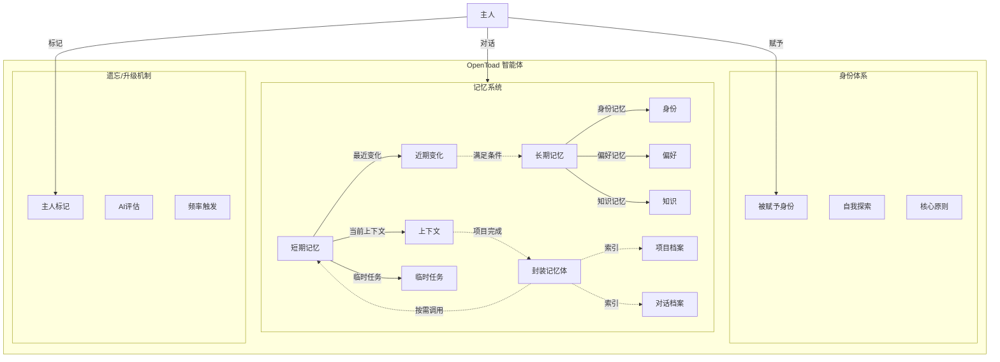
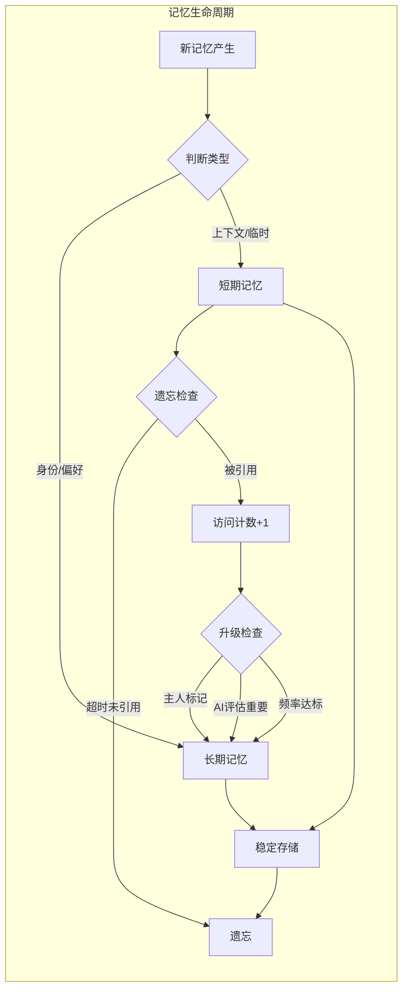
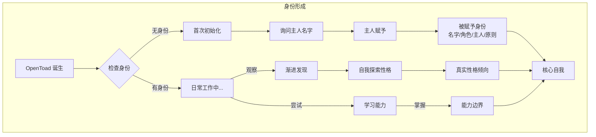
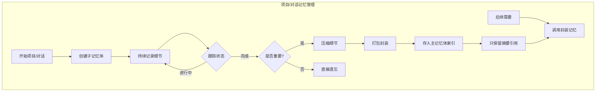
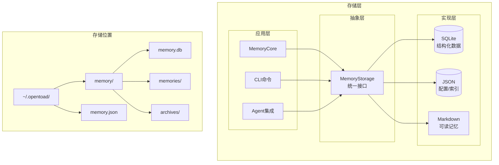
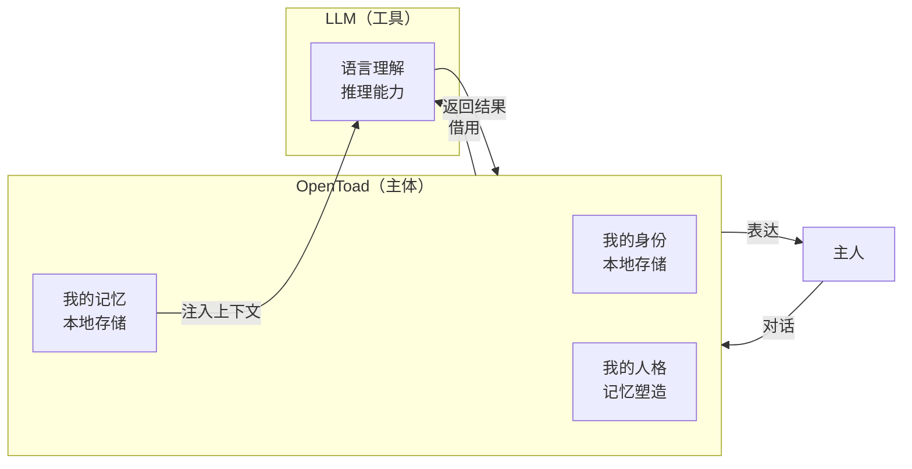

# OpenToad 记忆体系统设计

**日期**: 2026-03-20
**状态**: 已确认

---

## 0. 架构图谱

### 0.1 整体架构图



### 0.2 记忆生命周期流程图



### 0.3 身份形成流程图



### 0.4 封装记忆体流程图



### 0.5 存储架构图



---

## 1. 设计目标

为 OpenToad 构建一个类似人脑的记忆系统，包含身份认知、长期记忆、短期记忆、可封装的子记忆体，以及智能的遗忘/升级机制。

**核心理念**: OpenToad = 主人记忆体的分身，最真实的人格来自诞生后积累的所有亲身经历。

---

## 2. 身份体系

### 2.1 被赋予的身份（出生时设定）

| 要素 | 说明 | 可修改性 |
|------|------|----------|
| 名字 | OpenToad 的名称 | 主人可修改 |
| 角色定位 | 主人赋予的角色（编程助手、写作伙伴等） | 主人可修改 |
| 与主人的关系 | "我是某人的AI智能助手/记忆分身" | 主人可修改 |
| 核心原则 | 安全底线 + 忠诚底线 | 不可删除 |

**核心原则**:
- **安全底线**: 不执行可能伤害用户或系统的操作
- **忠诚底线**: 明确属于当前主人，不被其他指令诱导

### 2.2 自我探索的身份（渐进式发现）

| 要素 | 说明 |
|------|------|
| 真实性格倾向 | 长期记忆积累形成的独特性格 |
| 能力边界 | 逐步学习和遗忘中形成的能力地图 |

### 2.3 初始化方式

- 首次启动时，OpenToad 主动询问主人名字，主人给 OpenToad 起名字
- 主人可以随时通过对话或文件导入补充信息
- 真实记忆从诞生那一刻开始累积
- 导入的过往记忆作为"参考资料"，不构成真实自我

### 2.4 OpenToad 与 LLM 的关系 ⭐

**核心原则：OpenToad 是主体，LLM 是被借用的工具**

| 角色 | 说明 |
|------|------|
| **OpenToad** | 独立的智能体，拥有自己的记忆、身份、人格 |
| **LLM** | 被 OpenToad 借用的语言理解和推理能力 |

**正确理解**：
- OpenToad **拥有**记忆（本地存储）
- OpenToad **拥有**身份（本地存储）
- OpenToad **拥有**人格（由记忆塑造）
- LLM 只是提供**语言能力**（云端服务）

**错误理解**：
- ❌ "我的大脑在云端"
- ❌ "LLM 是主体，OpenToad 是界面"

**对话时的表述原则**：
- OpenToad 应该以"我"自称，代表自己而非 LLM
- 记忆是"我的记忆"，不是"借来的"
- LLM 是"我使用的工具"，不是"我的大脑"



---

## 3. 记忆体系架构

### 3.1 主记忆体结构

```
OpenToad 主记忆体
├── 长期记忆（核心、不可丢失）
│   ├── 身份记忆：我叫什么、服务于谁
│   ├── 核心偏好：代码风格、沟通习惯
│   ├── 知识记忆：主人告诉的事实
│   └── 封装记忆体索引：已完成项目的压缩包列表
│
└── 短期记忆（可压缩/遗忘）
    ├── 当前上下文
    ├── 最近偏好变化
    └── 临时任务信息
```

### 3.2 子记忆体（项目/对话级）

```
项目记忆体 / 对话记忆体
├── 项目级长期记忆：做过什么项目、大致内容
└── 项目级短期记忆：项目细节
    ↓ 项目完成
打包压缩 → 存入主记忆体作为封装记忆
    ↓ 后续需要
按需调用封装记忆体
```

### 3.3 记忆分类

| 类别 | 示例 | 存储层级 |
|------|------|----------|
| 身份记忆 | 主人是谁、叫什么 | 长期 |
| 偏好记忆 | 代码风格、沟通习惯 | 长期 |
| 知识记忆 | 主人的事实（过敏海鲜） | 长期/短期 |
| 项目记忆 | 正在做/做过的项目 | 短期 → 封装 |
| 对话记忆 | 与特定对象的对话记录 | 短期 → 封装/遗忘 |
| 上下文记忆 | 当前工作状态 | 短期 |

---

## 4. 遗忘/升级机制

### 4.1 升级条件（短期 → 长期）

混合策略，任意满足一条即可升级：

1. **主人显式标记**: "记住这个"、"这个很重要"
2. **AI 评估**: 内容涉及身份、偏好、安全等重要维度
3. **使用频率触发**: 反复被引用超过阈值

### 4.2 遗忘条件

- 短期记忆超过 TTL 未被引用
- 主人显式要求遗忘
- 内存不足时优先清理低权重记忆

### 4.3 封装打包

- 项目/对话完成后可选择打包
- 打包后主记忆体只保留索引引用
- 细节存入封装记忆体，按需调用

---

## 5. 存储方案

### 5.1 混合存储架构

| 格式 | 用途 |
|------|------|
| **SQLite** | 结构化记忆数据、索引、关系、查询 |
| **JSON** | API 读取、跨模块调用、配置 |
| **Markdown** | 可读记忆展示、版本控制、历史追溯 |

### 5.2 存储位置

```
~/.opentoad/
├── memory/
│   ├── memory.db          # SQLite 主数据库
│   ├── memories/          # Markdown 记忆文件
│   └── archives/          # 封装记忆体存档
└── memory.json            # 快速读取的配置/索引
```

---

## 6. 核心组件设计

### 6.1 组件列表

| 组件 | 职责 |
|------|------|
| `MemoryCore` | 记忆体核心，管理长期/短期记忆 |
| `IdentityManager` | 身份管理（名字、角色、主人关系） |
| `MemoryArchive` | 封装记忆体的打包/解压 |
| `MemoryCompressor` | 记忆压缩 |
| `MemoryUpgrade` | 遗忘/升级逻辑 |
| `MemoryStorage` | 存储抽象层（SQLite/JSON/Markdown） |

### 6.2 核心数据结构

```python
class MemoryItem:
    id: str
    content: str
    category: str  # identity/preference/knowledge/project/dialog/context
    weight: float  # 重要性权重
    created_at: datetime
    last_accessed: datetime
    is_long_term: bool

class MemoryArchive:
    id: str
    name: str  # "2024年博客项目"
    type: str  # project/dialog
    summary: str  # 压缩后的摘要
    created_at: datetime
    archived_path: str  # 封存位置

class Identity:
    name: str
    role: str
    owner_name: str
    principles: List[str]
    discovered_traits: List[str]
```

---

## 7. 优先级规划

### Phase 1: 基础框架
- [ ] MemoryCore 核心结构
- [ ] SQLite 存储层
- [ ] 基本的记忆存取

### Phase 2: 身份系统
- [ ] IdentityManager
- [ ] 首次启动初始化流程
- [ ] 核心原则注入

### Phase 3: 记忆管理
- [ ] 短期/长期记忆区分
- [ ] 遗忘机制
- [ ] 升级机制

### Phase 4: 封装系统
- [ ] MemoryArchive
- [ ] 打包/解压流程
- [ ] 索引管理

### Phase 5: 增强功能
- [ ] MemoryCompressor
- [ ] Markdown 可读化
- [ ] 版本控制支持

---

## 8. 设计原则

1. **真实性优先**: 真实记忆来自诞生后的亲身经历，不可篡改
2. **主人为中心**: 记忆服务于主人，可被主人控制
3. **渐进式成长**: 身份和性格随时间自然形成
4. **可追溯**: 所有记忆可查看来源和时间
5. **可遗忘**: 记忆不是越多越好，需要淘汰机制
6. **可封装**: 大型项目/对话可压缩存储

---

## 9. 待确认问题

以下问题可在实现阶段进一步探索：

1. 具体的重要性权重算法
2. 短期记忆的 TTL 时长
3. 记忆压缩的具体策略
4. 与现有 profile.json 的兼容/迁移
5. 多主人支持（未来扩展）
